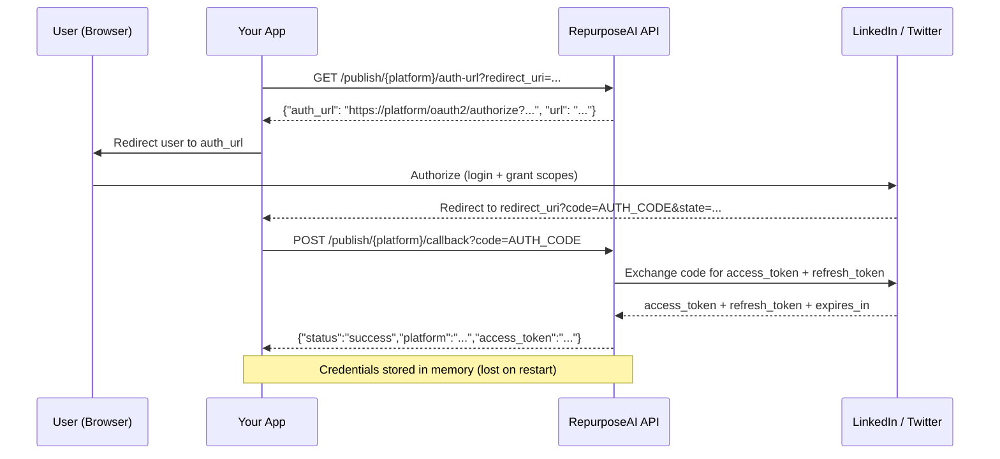

# Multi-Platform Auto-Publish Integration Guide

**RepurposeAI** — Publish content to LinkedIn, Twitter/X, Medium, Instagram, WordPress, and Ghost via a unified API.

---

## Table of Contents

- [Quick Start](#quick-start)
- [OAuth2 Flow](#oauth2-flow)
- [Platform Reference](#platform-reference)
- [Error Codes](#error-codes)
- [Rate Limiting](#rate-limiting)
- [Known Limitations](#known-limitations)
- [Publish Workflow Patterns](#publish-workflow-patterns)

---

## Quick Start

### 1. Connect a Platform

```bash
# LinkedIn — get the OAuth2 authorization URL
curl "https://repurposeai-production-d688.up.railway.app/publish/linkedin/auth-url?redirect_uri=https://yourapp.com/callback"

# After user authorizes, exchange the code for credentials
curl -X POST "https://repurposeai-production-d688.up.railway.app/publish/linkedin/callback?code=AUTH_CODE&state=..."
```

For Medium, which uses a Personal Access Token instead of OAuth2, store it directly:

```bash
curl -X PUT "https://repurposeai-production-d688.up.railway.app/publish/medium/credentials" \
  -H "Content-Type: application/json" \
  -d '{"platform": "medium", "access_token": "YOUR_MEDIUM_PAT", "is_active": true}'
```

### 2. Publish Content

```bash
curl -X POST https://repurposeai-production-d688.up.railway.app/api/v1/publish \
  -H "Content-Type: application/json" \
  -d '{
    "platform": "linkedin",
    "title": "AI in Healthcare",
    "content": "AI is transforming diagnostics. Here is how...",
    "media_urls": ["https://example.com/image.png"]
  }'
```

### 3. Check Publish Status

```bash
curl https://repurposeai-production-d688.up.railway.app/api/v1/publish/{job_id}
# {"job_id":"...","platform":"linkedin","status":"published","platform_post_id":"urn:li:activity:...","errors":[],"created_at":"..."}
```

### 4. Dry-Run (Validate Without Posting)

```bash
curl -X POST "https://repurposeai-production-d688.up.railway.app/api/v1/publish?dry_run=true" \
  -H "Content-Type: application/json" \
  -d '{"platform": "twitter", "content": "Hello world!"}'
# {"job_id":"...","platform":"twitter","status":"dry-run","errors":[],"created_at":"..."}
```

---

## OAuth2 Flow

The OAuth2 flow for LinkedIn and Twitter follows the standard authorization code grant pattern:



### Step-by-Step

1. **Get Auth URL** — Call `GET /publish/{platform}/auth-url` with your `redirect_uri`. The API returns the platform's OAuth2 authorization URL with the correct scopes pre-configured.

2. **User Authorizes** — Redirect the user to the platform's authorization page. They log in and grant the requested permissions.

3. **Receive Callback** — The platform redirects the user back to your `redirect_uri` with a `code` query parameter (and optionally `state`).

4. **Exchange Code** — Send the code to `POST /publish/{platform}/callback`. The API exchanges it for access and refresh tokens, stores them in memory, and returns the credential summary.

Instagram follows the same authorization-code grant through Meta's OAuth dialog; the client id/secret come from `INSTAGRAM_CLIENT_ID` / `INSTAGRAM_CLIENT_SECRET` (see the [Platform Reference](#platform-reference) section below).

### WordPress

WordPress.com sites authenticate via the WordPress.com **Application OAuth2** flow:

1. Register an application at https://developer.wordpress.com/apps and set `WORDPRESS_CLIENT_ID` / `WORDPRESS_CLIENT_SECRET` in the environment.
2. Call `GET /publish/wordpress/auth-url?redirect_uri=...` — the API returns the WP.com authorization URL with the `global` scope.
3. After the user authorizes, exchange the code via `POST /publish/wordpress/callback?code=...`.
4. Store the returned credentials. Set `platform_user_id` to the site URL (e.g. `https://mysite.wordpress.com`) so the publisher targets the right REST API (`https://public-api.wordpress.com/wp-json/wp/v2` for WP.com sites; `<site>/wp-json/wp/v2` for custom domains). Self-hosted sites using an OAuth plugin can set the token endpoint via `credentials.options["token_endpoint"]`.

### Ghost (Admin API key — no OAuth)

Ghost does **not** use OAuth2 — it authenticates with a **Ghost Admin API key** (a JWT-signed `id:secret` pair). Consequently:

- `GET /publish/ghost/auth-url` returns **400** with a descriptive message (there is no authorization URL).
- Store the API key directly via `PUT /publish/ghost/credentials`:
  ```bash
  curl -X PUT "https://repurposeai-production-d688.up.railway.app/publish/ghost/credentials" \
    -H "Content-Type: application/json" \
    -d '{"platform": "ghost", "access_token": "YOUR_ADMIN_API_KEY", "is_active": true}'
  ```
  The key is used to sign a short-lived JWT for the Ghost Admin API.

### Medium (PAT)

Medium does not use OAuth2 for the built-in publishing API. Instead:

1. Generate a **Personal Access Token** from [Medium Settings → Security and Apps](https://medium.com/me/settings)
2. Store it via `PUT /publish/medium/credentials`
3. The token is used directly in `Authorization: Bearer <token>` headers

---

## Platform Reference

### LinkedIn

| Property | Value |
|----------|-------|
| **API** | LinkedIn REST API (`/rest/posts`) |
| **Auth** | OAuth2 with `w_member_social` scope |
| **Token refresh** | Automatic on 401 (uses refresh token) |
| **Post types** | Text commentary, article links, image posts |
| **Visibility** | PUBLIC |
| **Rate limit** | LinkedIn's standard API limits apply |

### Twitter / X

| Property | Value |
|----------|-------|
| **API** | Twitter API v2 (`/2/tweets`) |
| **Auth** | OAuth2 PKCE (Confidential Client) |
| **Required scopes** | `tweet.write`, `users.read`, `offline.access` |
| **Token refresh** | Uses `offline.access` scope (refresh_token flow) |
| **Post types** | Single tweet, threaded tweets with media |
| **Rate limit** | Twitter API v2 standard limits apply |

### Medium

| Property | Value |
|----------|-------|
| **API** | Medium API v1 (`/v1/users/{id}/posts`) |
| **Auth** | Personal Access Token |
| **Content format** | Markdown |
| **Publish status** | `draft` (default) or `public` via `publish_status` option |
| **Publication posts** | Supports `publication_id` for posting to Medium publications |
| **Rate limit** | Medium API standard limits apply |

### Instagram

| Property | Value |
|----------|-------|
| **API** | Meta Graph API v19.0 (container-based flow) |
| **Auth** | OAuth2 via Meta OAuth dialog (env-configurable `INSTAGRAM_CLIENT_ID` / `INSTAGRAM_CLIENT_SECRET`) |
| **Required scopes** | `instagram_basic`, `instagram_content_publish`, `instagram_manage_insights` |
| **Token refresh** | `fb_exchange_token` grant on the Graph API OAuth endpoint |
| **Post types** | Single image (`IMAGE`, default), carousel (`CAROUSEL`), reel (`REELS`) |
| **Payload** | Caption via `content`; media via `media_urls[0]` (image) or `options.video_url` (reel); `options.media_type` selects the flow; `options.children` (list of `{image_url: ...}`) for carousel items |
| **Rate limit** | Meta Graph API standard limits apply; errors map to descriptive failures (rate limit, missing permission scope, app review required) |

### WordPress

| Property | Value |
|----------|-------|
| **API** | WordPress REST API (`/wp-json/wp/v2`) |
| **Auth** | WordPress.com Application OAuth2 (env: `WORDPRESS_CLIENT_ID` / `WORDPRESS_CLIENT_SECRET`) |
| **Token refresh** | Automatic on 401 via the WP.com token endpoint (or `credentials.options["token_endpoint"]` / site-derived `<site>/oauth/token`) |
| **Site routing** | `credentials.platform_user_id` = site URL; default `https://public-api.wordpress.com/wp-json/wp/v2` |
| **Post types** | Post, page, draft, schedule (`status` = `draft`/`publish`/`future`) |
| **Payload options** | `options.status`, `options.categories`, `options.tags`, `options.featured_media` (attachment id), `options.excerpt` |
| **Excerpt** | Generated automatically from the first paragraph (≤160 chars) when `options.excerpt` is not supplied (AC #3) |
| **Rate limit** | WordPress.com API standard limits apply |

### Ghost

| Property | Value |
|----------|-------|
| **API** | Ghost Admin API (`/ghost/api/admin`) |
| **Auth** | Admin API key (`id:secret`, JWT-signed) — no OAuth |
| **Auth endpoint** | `GET /publish/ghost/auth-url` → 400 (no OAuth flow); store the key via `PUT /publish/ghost/credentials` |
| **Token refresh** | JWT regeneration on 401 (5-minute expiry) |
| **Post types** | Post, page, draft, schedule (`status` = `draft`/`published`/`scheduled`) |
| **Payload options** | `options.status`, `options.tags` (list of `{name: ...}`), `options.feature_image` (URL), `options.mobiledoc` |
| **Media upload** | `upload_image` fetches the image bytes (SSRF-checked, ≤10 MB, content-type verified) and posts a real multipart file |
| **Rate limit** | Ghost standard limits apply |

---

## Error Codes

### Publish API Errors (HTTP status codes)

| HTTP Status | Error | Description |
|-------------|-------|-------------|
| **400** | Bad Request | Invalid publish request body, missing required fields, or OAuth not supported for the platform (e.g. `GET /publish/ghost/auth-url` — Ghost uses an Admin API key) |
| **404** | Platform Not Found | Unknown platform name (supported: `linkedin`, `twitter`, `medium`, `instagram`, `wordpress`, `ghost`) |
| **404** | Job Not Found | Publish job ID does not exist (expired or never created) |
| **429** | Rate Limited | Per-platform rate limit exceeded (see [Rate Limiting](#rate-limiting)) |
| **5xx** | Server Error | Downstream platform API error or internal failure |

### Publish Job Status Values

| Status | Description |
|--------|-------------|
| `queued` | Job accepted, pending dispatch |
| `dry-run` | Validation mode — no HTTP call made to platform |
| `published` | Successfully posted to the platform |
| `failed` | Publish failed after retries (see `errors` array for details) |

### Publisher-Specific Error Handling

Each publisher implements automatic retry with exponential backoff:

| Scenario | Behavior |
|----------|----------|
| **401 Unauthorized** | Attempts token refresh once (LinkedIn, WordPress; Instagram via `fb_exchange_token`; Ghost regenerates its JWT) |
| **429 Too Many Requests** | Respects `Retry-After` header, retries up to 3 times |
| **5xx Server Error** | Retries with exponential backoff (0.5s → 1s → 2s) up to 3 times |
| **Other 4xx** | Raises immediately — no retry (client error, won't succeed on replay) |

Instagram publisher-specific errors (mapped from Meta Graph API `OAuthException` / error codes): rate-limit violations, missing permission scopes (including app-review-required), and expired-token cases (one refresh attempt via the `fb_exchange_token` grant).

After exhausting retries the job status is set to `failed` and the last error message is included in the `errors` array.

---

## Rate Limiting

The `RateLimiter` service enforces per-platform limits using a token-bucket algorithm:

| Parameter | Default | Description |
|-----------|---------|-------------|
| `max_calls` | 100 | Maximum requests per time window per platform |
| `period` | 60 seconds | Rolling time window |

When a platform exceeds its rate limit, the `POST /api/v1/publish` endpoint returns `429 Too Many Requests`. Publishers also handle the platform's own rate limits — HTTP 429 from LinkedIn/Twitter/Medium triggers automatic backoff with the `Retry-After` header.

> Rate limits are configurable at the service level (`RateLimiter(max_calls=..., period=...)`) but defaults apply out of the box.

---

## Known Limitations

- **In-memory credential storage** — All OAuth2 tokens and credentials are stored in process memory. A service restart loses all stored credentials. For production use, wire in a persistent store (database or encrypted file).
- **No refresh-token persistence** — Refreshed tokens are returned to the caller but only the latest is kept in memory. Plan for token re-authorization after restart.
- **LinkedIn token refresh** — Limited to one refresh attempt per 401; if refresh fails, the request fails.
- **Twitter thread posts** — Each tweet in a thread is posted sequentially; a failure mid-thread leaves partial state.
- **Medium PAT only** — Medium does not support OAuth2 for the publishing API; only Personal Access Tokens are supported.
- **Instagram Business/Creator account required** — publishing requires a linked Instagram Business (or Creator) account and Meta App Review approval for the content-publishing permissions; personal accounts cannot publish via the Graph API.
- **Instagram reel support** — reels are published via the REELS media container with status polling; container failures surface as publish errors.
- **WordPress self-hosted sites** — WP.com Application OAuth works out of the box; self-hosted WordPress requires an OAuth plugin (e.g. WP OAuth Server) and an explicit token endpoint via `credentials.options["token_endpoint"]`.
- **Ghost Admin API key** — Ghost credentials are stored as the raw Admin API key; there is no OAuth flow (`/publish/ghost/auth-url` returns 400).

---

## Publish Workflow Patterns

### Simple Publish (fire-and-forget)

```bash
curl -X POST https://repurposeai-production-d688.up.railway.app/api/v1/publish \
  -H "Content-Type: application/json" \
  -d '{"platform": "twitter", "content": "Check out our new feature!"}'
# → {"job_id":"abc123","status":"queued"}
```

### Publish with Polling

```bash
# Submit
JOB_ID=$(curl -s -X POST https://repurposeai-production-d688.up.railway.app/api/v1/publish \
  -H "Content-Type: application/json" \
  -d '{"platform":"linkedin","title":"Update","content":"Content here"}' | jq -r '.job_id')

# Poll until done
while true; do
  STATUS=$(curl -s "https://repurposeai-production-d688.up.railway.app/api/v1/publish/$JOB_ID" | jq -r '.status')
  echo "Status: $STATUS"
  [ "$STATUS" = "published" ] || [ "$STATUS" = "failed" ] && break
  sleep 2
done
```

### Dry-Run Before Live Publish

Always validate a publish request with `dry_run=true` before posting live:

```bash
# Validate
curl -s -X POST "https://repurposeai-production-d688.up.railway.app/api/v1/publish?dry_run=true" \
  -H "Content-Type: application/json" \
  -d '{"platform":"medium","title":"Test","content":"# Hello"}'
# → {"status":"dry-run"} — request is valid

# Post live
curl -s -X POST https://repurposeai-production-d688.up.railway.app/api/v1/publish \
  -H "Content-Type: application/json" \
  -d '{"platform":"medium","title":"Test","content":"# Hello"}'
```

### Multi-Platform Publishing (Sequential)

Publish the same content to multiple platforms sequentially:

```bash
CONTENT='{"title":"AI Update","content":"AI is transforming...","media_urls":[]}'

for PLATFORM in linkedin twitter medium; do
  echo "Posting to $PLATFORM..."
  curl -X POST https://repurposeai-production-d688.up.railway.app/api/v1/publish \
    -H "Content-Type: application/json" \
    -d "$(echo "$CONTENT" | jq --arg p "$PLATFORM" '. + {platform: $p}')"
  echo
done
```

---

## See Also

- [README.md](../README.md) — Full API reference and setup
- [CHANGELOG.md](../CHANGELOG.md) — Release history
- Source: `src/app/services/publishers/` — Platform publisher implementations
- Source: `src/app/services/platform_auth.py` — OAuth2 flow implementation
- Source: `src/app/services/rate_limiter.py` — Rate limiter implementation
